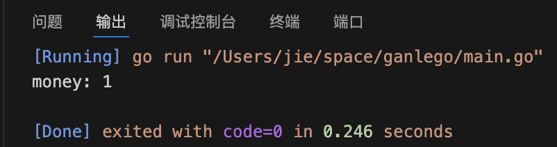
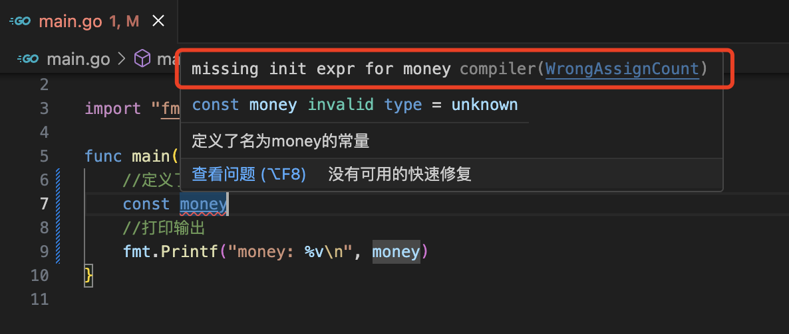
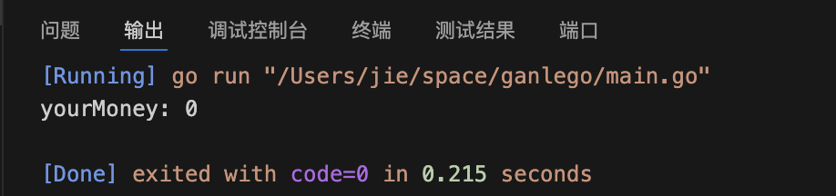
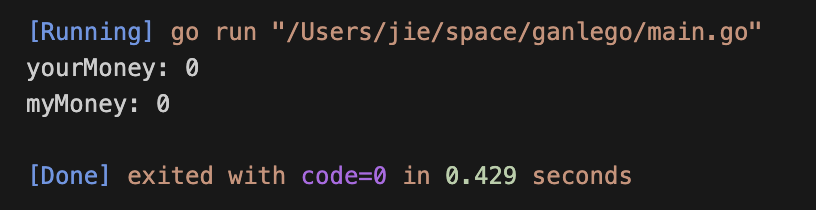
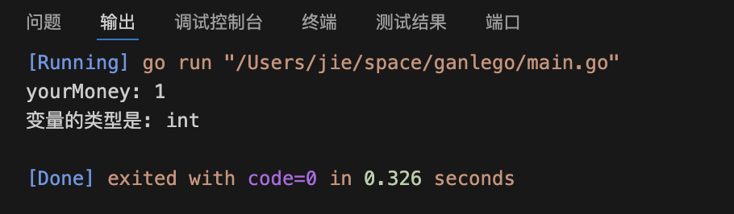

# go的常量和变量
## 常量 
常量就是一成不变的量，用日常的解释方式比如1块钱是一个常量，那么1块钱就是一块钱不会是1.5元或者0.5元
### 常量的快速上手
```
package main

import "fmt"

func main() {
	//声明了名为money的常量
	const money = 1
	//打印输出
	fmt.Printf("money: %v\n", money)
}
```
这里我声明了一个名为money的常量并将其打印输出，下面是效果展示：

### 常量的声明
常量使用const关键字来进行定义，语法格式如下
```
const 常量名称 = 初始值
```


这里“常量名称”是需要自己来定的，而且每个常量在声明的时候必须给定初始值，如果不给定初始值就会提示报错，如图所示：

### 常量的注意事项
1.常量在声明之后，它的值是不可能改变的。<br/>
2.常量在声明时，必须给定初始值.<br/>

## 变量
变量就是表示会改变的一个值，和常量相反，在变量在声明之后，它的值是可以改变的。
### 变量的快速上手

```
package main

import "fmt"

func main() {
	// 定义了一个名为yourMoney的变量，数据类型为int
	var yourMoney int
	// 打印输出
	fmt.Printf("yourMoney: %v\n", yourMoney)
}

```
上面我定义了一个变量名为yourMoney的变量，然后直接打印看看这个变量，上效果图：

“你的钱钱为0！”，好了这里你注意到了，变量就算没有用 "=" 来进行赋值，它本身也是具有初始值的，这里我声明了yourMoney的变量之后，直接打印，它的初始值为0，“具有初始值”也是变量的一大特点，变量还有更多的特点在后面继续说，这里只是快速上手。
### 变量的声明
变量和常量一样，需要声明之后才能使用，你要使用一个变量，那么它必须有一个它自己的名字，这里有两种声明方式：<br>


#### 1.标准声明
标准声明的语法如下：
```
var 变量名 变量类型
```
实际使用如下：
```
package main

import "fmt"

func main() {
	// 定义了一个名为yourMoney的变量，数据类型为int
	var yourMoney int
	// 打印输出
	fmt.Printf("yourMoney: %v\n", yourMoney)
}
```
以上就是一个标准声明

#### 2.批量声明
接下来使用的是批量声明，和常量一样，变量也是可以一次性声明多个的。
```
package main

import "fmt"

func main() {
	// 定义了两个变量
	var (
		yourMoney int
		myMoney   int
	)
	// 打印输出
	fmt.Printf("yourMoney: %v\n", yourMoney)
	fmt.Printf("myMoney: %v\n", myMoney)
}
```

上面是效果展示，当然不是暗示我和你的钱钱都是0嗷，是因为声明了变量之后它本身就具有初始值，下面的内容就开始讲解变量的初始化。

### 变量的初始化
变量的使用，第一步是需要声明，第二步来对它进行初始化赋值，语法如下：
```
var 变量名 类型 = 指定值
```
简单使用
```
var yourMoney int = 1
```

### 变量的类型推导
什么叫变量的类型推到，在golang中，你定义一个变量有时候可以不需要指定类型，程序运行中会自动推导出你定义的变量是什么类型的，使用效果如下：
```
package main

import (
	"fmt"
	"reflect"
)

func main() {

	var yourMoney = 1
	fmt.Printf("yourMoney: %v\n", yourMoney)
	fmt.Printf("变量的类型是: %v\n", reflect.TypeOf(yourMoney))
}
```

在上面的代码中定义了一个变量“yourMoney”，但是你没有指定类型，而且可以正常使用，这里我使用了reflect.TypeOf()这个方法将变量的类型给打印了出来
打印的结果现实“yourMoney“这个变量是int类型的

### 更简洁的使用变量的方式
来让我教你更简洁的变量语法，看好了嗷：
```
package main

import (
	"fmt"
	"reflect"
)

func main() {

	yourMoney := 1
	fmt.Printf("yourMoney: %v\n", yourMoney)
	fmt.Printf("变量的类型是: %v\n", reflect.TypeOf(yourMoney))
}
```
在我们使用和日常工作中，最喜欢的就是使用这种短变量的方式，使用“:=”这个语法就可以直接声明变量，是不是有够简单，日后我们都是使用这种方式来声明变量的，可要记牢了。

### 匿名变量
什么叫匿名变量，先上代码:
```
package main

import "fmt"

func main() {

	friends := []string{"Tom", "jerry"}
	for _, friend := range friends {
		fmt.Printf("friend: %v\n", friend)
	}
}
```
在上面的代码中，你会看到这个下划线"_"，这个就是一个匿名变量，在golang中常量和变量在声明之后是必须要使用的，如果遇到你想用，但是它一直都存在的变量，你可以用下划线“_”来代替它，这样你就可以忽略了。
## 变量和常量的注意事项
>1.变量和常量都具有作用域。<br>
什么叫作用域，你骑共享单车的时候，又一个范围，出了这个范围，这个共享单车就不能用了，这个范围就是作用域。<br>
>2.后续补充中····


