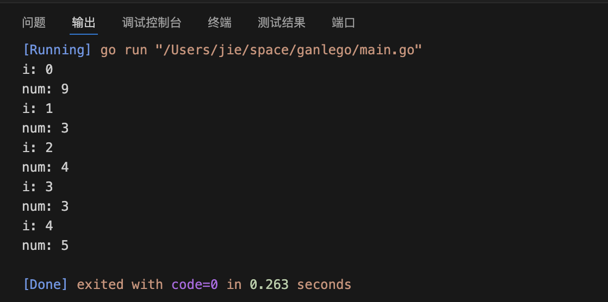
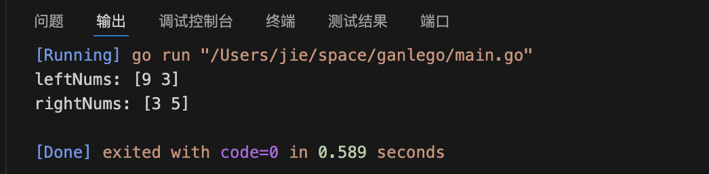

## 数组的遍历

```
package main

import "fmt"

func main() {

	//声明一个名为nums的数组
	nums := []int{9, 3, 4, 3, 5}

	//i是遍历时候的索引值，num是当前遍历的元素值
	for i, num := range nums {
		fmt.Printf("i: %v\n", i)
		fmt.Printf("num: %v\n", num)
	}
}

```


## 数组的切割
```
package main

import "fmt"

func main() {

	//声明一个名为nums的数组
	nums := []int{9, 3, 4, 3, 5}

	//给定一个索引值，将数组切分成为左右两边两个数组，不包含当前索引元素

	numsIndex := 2

	leftNums := nums[:numsIndex]
	rightNums := nums[numsIndex+1:]

	//打印结果
	fmt.Printf("leftNums: %v\n", leftNums)
	fmt.Printf("rightNums: %v\n", rightNums)

}

```

注意在切割的时候要想右边的结果集不包含当前索引元素，就要加一位